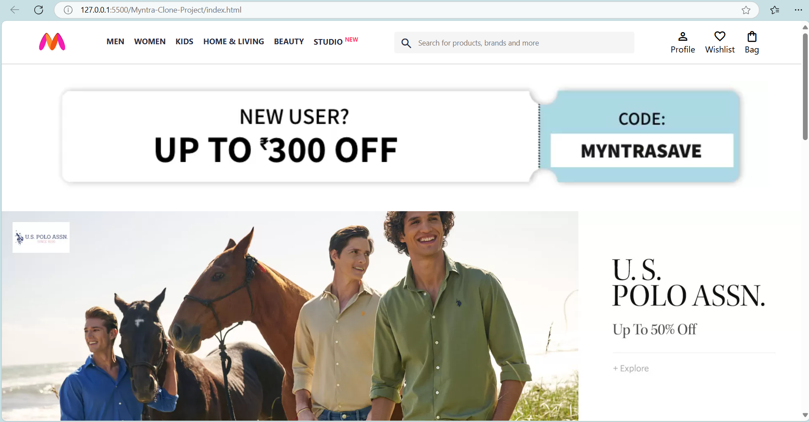

# Myntra Clone - CSS Project

## 📌 Project Overview

This project is a **front-end clone** of the Myntra website, built using **HTML and CSS**. The goal of this project was to practice web design skills, including layout structuring, styling, and responsiveness.

## 🚀 Features

- **Fully Responsive Design** 📱💻
- **Navigation Bar & Dropdowns** 🏷️
- **Product Listing & Grid Layout** 👕
- **Hover Effects & Animations** ✨
- **Footer & Contact Section** 📞

## 🔧 Technologies Used

- **HTML5** 🏗️
- **CSS3 (Flexbox & Grid)** 🎨
- **Google Fonts & Icons** 🔤
- **Font Awesome Icons** 🎭

## 📂 Project Structure

```
Myntra-Clone/
│── index.html   # Homepage
│── styles.css   # Main stylesheet
│── images/      # Assets & images
│── .gitignore   # Git ignore file
│── LICENSE      # License file
└── README.md    # Project documentation
```

## 🖥️ How to Run the Project

1. **Clone the repository**
   ```sh
   git clone https://github.com/amit-tripathi11/Myntra-Clone-Project.git
   ```
2. **Open ************`index.html`************ in a browser**

## 📸 Homepage Screenshot


## 🤝 Contributing

Feel free to fork this repository and enhance the project! PRs are welcome. 😊

## 📜 License

This project is for educational purposes only. It is not affiliated with or endorsed by Myntra.

---

Author: Amit Tripathi

